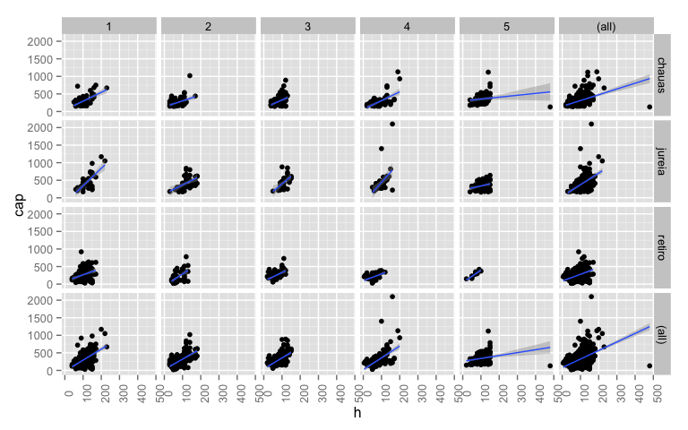
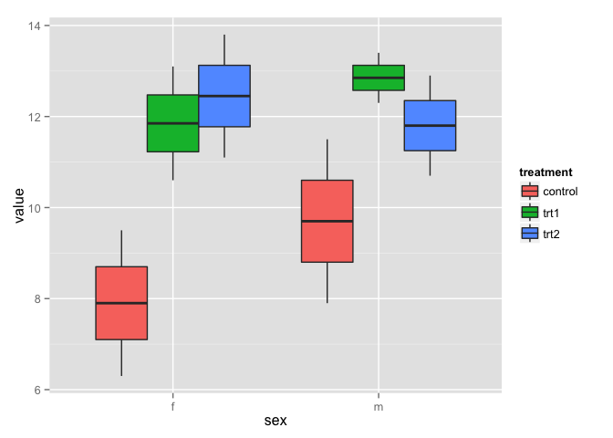

1.  Create a vector `simul_vec` of random numbers sampled from the
    distribution of your choice (Normal, Poisson, Binomial, etc).

        simul_vec <- rnorm(500)

2.  Create a function that returns a list with the mean and the standard
    deviation of the object `simul_vec`.

        get_mean_sd <- function(x) {
          list(mean = mean(x), sd = sd(x))
        }

3.  The function `rowMeans` returns the means of all rows in a
    data.frame. Create a function `sdMeans` that returns the sd of all
    rows (use the function `apply`). Read in the data [Mamiferos na
    Great
    Basin](http://ecologia.ib.usp.br/bie5782/lib/exe/fetch.php?media=dados:gbmam93.csv)
    and apply your function.

        mammals <- read.csv("http://ecologia.ib.usp.br/bie5782/lib/exe/fetch.php?media=dados:gbmam93.csv")

        sdMeans <- function(df) {
          apply(df, 1, sd)
        }

        sdMeans(mammals)

                1         2         3         4         5         6         7 
        0.4188539 0.4775669 0.4775669 0.2294157 0.5072573 0.4524139 0.3153018 
                8         9        10        11        12        13        14 
        0.5129892 0.4524139 0.4524139 0.3153018 0.4775669 0.3153018 0.3153018 

4.  Read in the data [Levantamento em 3 caixetais do Estado de São
    Paulo](http://ecologia.ib.usp.br/bie5782/lib/exe/fetch.php?media=dados:caixeta.csv).
    With `ggplot2`, make a scatterplot of `h` vs. `cap`, faceting by
    `local`~`parcela` using the `facet_grid()` component. Try to use the
    argument `margins = TRUE` in `facet_grid()`. Add a
    `geom_smooth(method = lm)`.

        library(ggplot2)

        caixetas <- read.csv("http://ecologia.ib.usp.br/bie5782/lib/exe/fetch.php?media=dados:caixeta.csv")

        ggplot(caixetas, aes(h, cap)) +
          geom_point() +
          geom_smooth(method = "lm") +
          facet_grid(local ~ parcela, margins = TRUE) +
          theme(axis.text.x = element_text(angle = 90))

    

5.  Create a data.frame from the data `Titanic` (already loaded in your
    R session) using the function `as.data.frame()`. Group the data by
    different variables (or multiple variables at once) and take the
    average frequency of survivors in the grouped data (use the package
    `dplyr`).

        library(dplyr)

        Titanic %>%
          as.data.frame() %>%
          group_by(Class, Age, Sex) %>%
          summarise(average_survived = mean(Freq))

        Source: local data frame [16 x 4]
        Groups: Class, Age [?]

            Class    Age    Sex average_survived
           (fctr) (fctr) (fctr)            (dbl)
        1     1st  Child   Male              2.5
        2     1st  Child Female              0.5
        3     1st  Adult   Male             87.5
        4     1st  Adult Female             72.0
        5     2nd  Child   Male              5.5
        6     2nd  Child Female              6.5
        7     2nd  Adult   Male             84.0
        8     2nd  Adult Female             46.5
        9     3rd  Child   Male             24.0
        10    3rd  Child Female             15.5
        11    3rd  Adult   Male            231.0
        12    3rd  Adult Female             82.5
        13   Crew  Child   Male              0.0
        14   Crew  Child Female              0.0
        15   Crew  Adult   Male            431.0
        16   Crew  Adult Female             11.5

        # proportion per Class
        library(tidyr)

        Titanic %>% 
          as.data.frame() %>%
          spread(Survived, Freq) %>%
          group_by(Class, Sex, Age) %>%
          mutate(prop_survived = Yes/sum(Yes, No)) %>%
          ungroup() %>%
          group_by(Class) %>%
          summarise("survived(%)" = round(mean(prop_survived, na.rm = TRUE)*100, 2))

        Source: local data frame [4 x 2]

           Class survived(%)
          (fctr)       (dbl)
        1    1st       82.45
        2    2nd       73.59
        3    3rd       33.63
        4   Crew       54.62

6.  Use the data below to create the data.frame `df2`

        df2 <- read.table(text = "ind   sex control trt1    trt2
        1   m   7.9 12.3    10.7
        2   f   6.3 10.6    11.1
        3   f   9.5 13.1    13.8
        4   m   11.5    13.4    12.9", header = TRUE)

7.  Convert `df2` to the long format with the function `gather` from the
    package `tidyr`. The columns `control`, `trt1` and `trt2` will be
    converted to 2 columns: 1) `treatment`, which will indicate the kind
    of condition in the experiment, and 2) `value` which will store the
    measurements for each observation.

        df2 <- df2 %>% gather(treatment, value, control:trt2) 

8.  Make a boxplot with `ggplot2` with the variable `sex` on the x axis,
    `value` on the y axis, and fill by `treatment`.

        ggplot(df2, aes(sex, value, fill = treatment)) +
          geom_boxplot()

    
